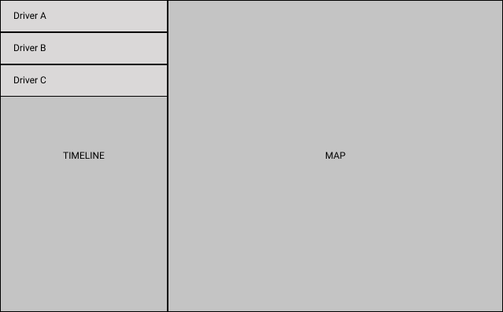

# Siametrics Frontend Engineer Testing

## Limitations

- You **must** only build a web frontend by using only React Framework.
- You **can** use any Web component library.
- You **must** use React-Redux-Saga .
- You **should** always determine best practice and web performace.
- You **can** use web worker, service worker to help increasing web performance if it is necessary.
- You **can** use webpack, babel, linter or any library to help you.
- You **must** create unit tests using jest.

## Requirements

1. Build a **Transportation Management System** for tracking drivers in our system.
1. Build Map Dashboard to see all driver routes, driver timelines.
1. Build a Timeline to see all driver perform at difference time.
1. Summarize working hour, Number of Item for each driver on timeline.
1. Can show or hide any driver on map dashboard.
1. Can Filter driver by name.
1. Show all nodes on map.

#### Wireframe

## SDK

### Map SDK

1. You must use MapboxGL for Map SDK.
1. Full documents https://docs.mapbox.com/mapbox-gl-js/api/

### Backend

1. You must use json-server for querying data.
2. Installation

```
npm install -g json-server
```

3. Start a backend server

```
json-server --watch db.json
```

4. Example of query
   `http://localhost:3000/jobs?_page=1&_limit=10`

5. All available service

```
GET /jobs
GET /nodes
```

## Submission
1. Send your git repo and also add markdown note to make sure we can run your program

## Good luck !!
